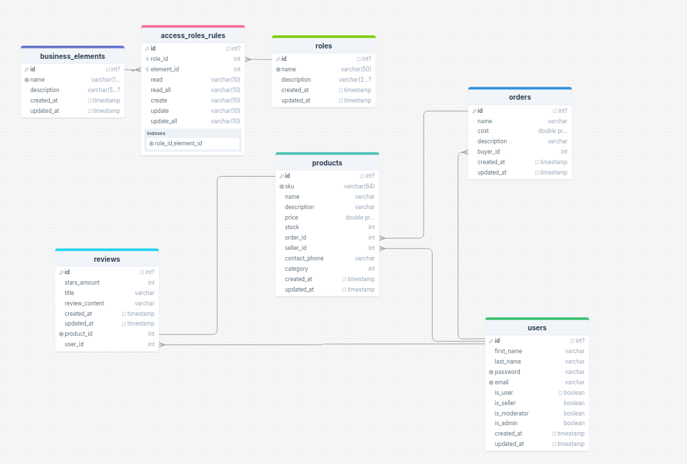
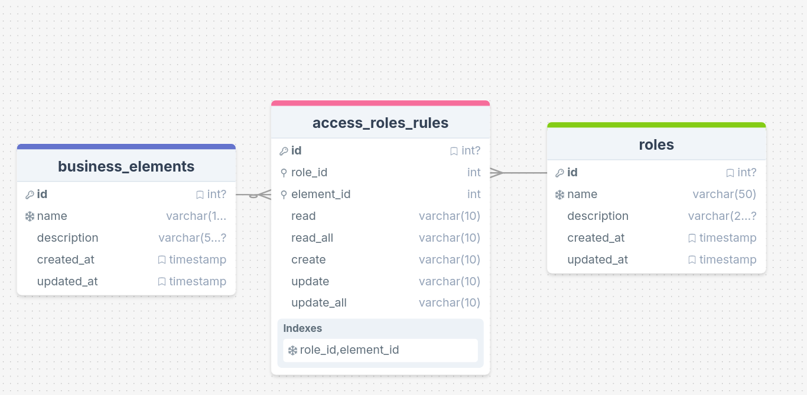

## Примечание к реализации

Согласно ТЗ, для раздела "Минимальные вымышленные объекты бизнес-приложения" было указано, что 
"Таблицы в БД создавать не требуется. Можно просто написать Mock-View...".

Однако, для демонстрации полной интеграции системы аутентификации и авторизации с бизнес-логикой, 
я реализовал полноценные модели и миграции для бизнес-объектов. Теперь можно проверить работу приложения, отправляя данные на эндпоинты.

### Что в базе данных



### Правила доступа

Правила доступа отражены в таблице access_roles_rules



role_id - внешний ключ, указывающий на все роли
element_id - внешний ключ, указываающий на все оступные ресурсы


В таблице представлены все права доступа, которые задаются при выполнении миграций:
 Роль | Ресурс | Чтение (read) | Чтение всех (read_all) | Создание (create) | Обновление (update) | Обновление всех (update_all) | Удаление (delete) | Удаление всех (delete_all) |
|------|--------|---------------|------------------------|-------------------|---------------------|------------------------------|-------------------|----------------------------|
| **Администратор** | Товары | ✓ | ✓ | ✓ | ✓ | ✓ | ✓ | ✓ |
| | Заказы | ✓ | ✓ | ✓ | ✓ | ✓ | ✓ | ✓ |
| | Отзывы | ✓ | ✓ | ✓ | ✓ | ✓ | ✓ | ✓ |
| | Правила доступа | ✓ | ✓ | ✓ | ✓ | ✓ | ✓ | ✓ |
| **Модератор** | Товары | ✓ | ✓ | ✗ | ✓ | ✓ | ✓ | ✓ |
| | Отзывы | ✓ | ✓ | ✗ | ✓ | ✓ | ✓ | ✓ |
| **Продавец** | Товары | ✓ | ✗ | ✓ | ✓ | ✗ | ✓ | ✗ |
| | Заказы | ✓ | ✗ | ✗ | ✓ | ✗ | ✗ | ✗ |
| | Отзывы | ✓ | ✗ | ✓ | ✓ | ✗ | ✓ | ✗ |
| **Покупатель** | Товары | ✓ | ✓ | ✗ | ✗ | ✗ | ✗ | ✗ |
| | Заказы | ✓ | ✗ | ✓ | ✓ | ✗ | ✓ | ✗ |
| | Отзывы | ✓ | ✓ | ✓ | ✓ | ✗ | ✓ | ✗ |
| **Гость** | Товары | ✓ | ✓ | ✗ | ✗ | ✗ | ✗ | ✗ |
| | Отзывы | ✓ | ✓ | ✗ | ✗ | ✗ | ✗ | ✗ |

---
 **Примечание:** Если у роли не отображены права для ресурса, значит пользователь не может никак взаимодействовать с этим ресурсом.

Пояснение к обозначениям
- **✓** - разрешено
- **✗** - запрещено

Расшифровка прав
- **Чтение (read)** - возможность просматривать только свои объекты
- **Чтение всех (read_all)** - возможность просматривать все объекты, независимо от владельца
- **Создание (create)** - возможность создавать новые объекты
- **Обновление (update)** - возможность редактировать только свои объекты
- **Обновление всех (update_all)** - возможность редактировать любые объекты
- **Удаление (delete)** - возможность удалять только свои объекты
- **Удаление всех (delete_all)** - возможность удалять любые объекты


Базовые роли и ресурсы также заносятся в бд при выполнении миграций

### Запуск

1) переходим в корневую папку (Test_task_EM)

2)
```
docker-compose up -d
```
3)
```
python -m venv venv
```
4)
```
. venv/bin/activate
```
5)
```
pip install -r reqs.txt
```
6)
```
alembic upgrade head
```
7)
```
uvicorn app.main:app
```
8) переходим на http://127.0.0.1:8000/docs